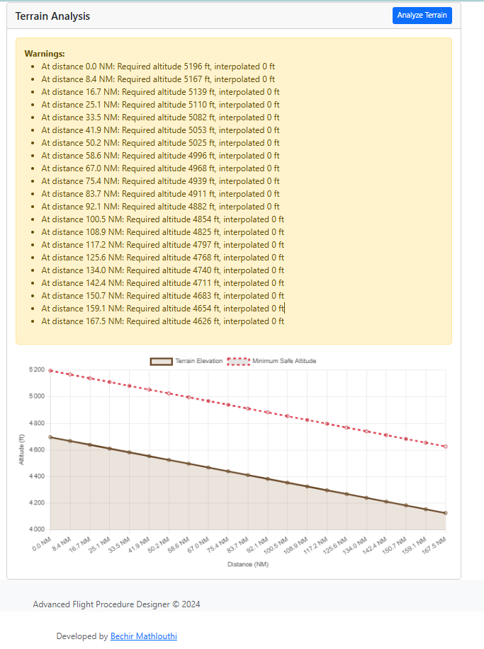
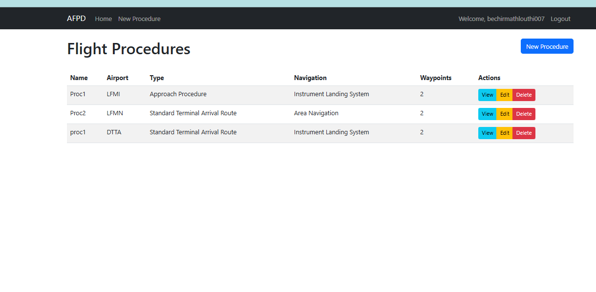
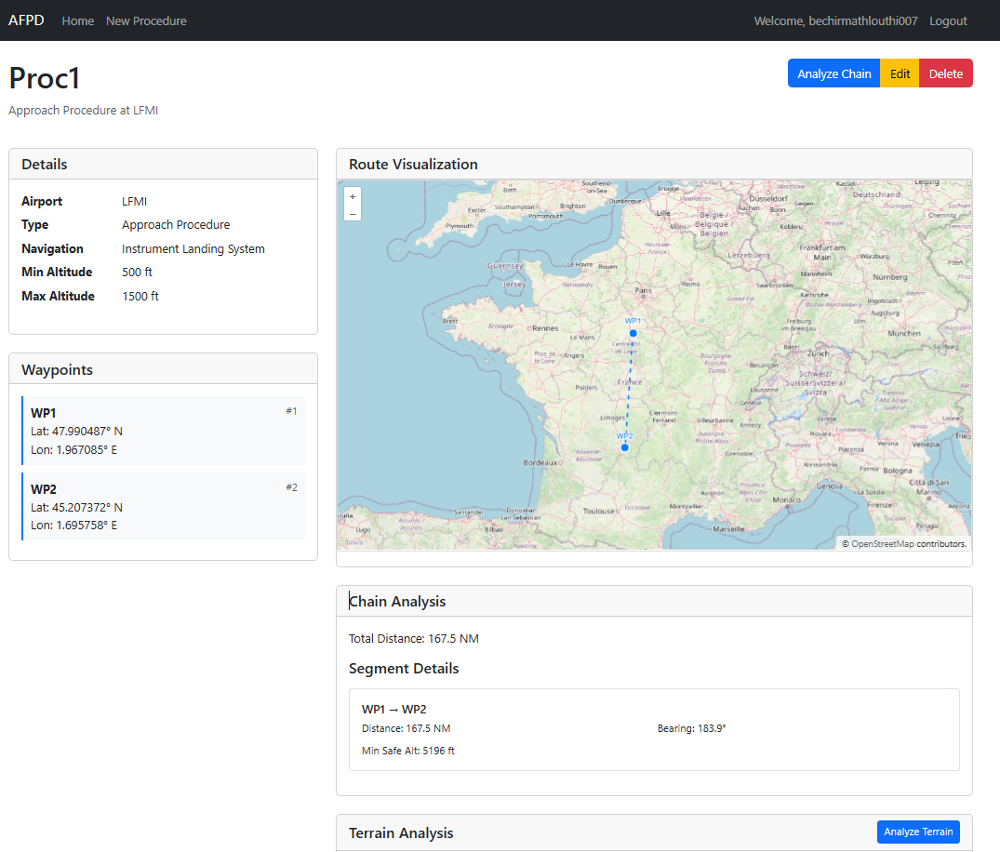

# Advanced Flight Procedure Designer (AFPD)

A sophisticated web application for designing and validating flight procedures with terrain analysis and ICAO compliance checking.

Developed by [Bechir Mathlouthi](https://github.com/Bechir-Mathlouthi)

## Screenshots

### Main Procedure Interface

*Main interface showing procedure management and controls*

### Procedure Design Interface

*Interactive map interface for designing flight procedures with real-time visualization*

### Terrain Analysis

*Detailed terrain analysis with elevation profile and clearance violations*

## Features

- **Interactive Procedure Design**
  - Visual waypoint placement on map
  - Drag-and-drop waypoint reordering
  - Real-time route visualization

- **Terrain Analysis**
  - Elevation data analysis along the route
  - Minimum safe altitude calculations
  - Terrain clearance violation detection
  - Visual terrain profile display

- **ICAO Compliance**
  - Automatic validation against ICAO standards
  - Procedure type-specific checks
  - Critical violation detection
  - Warning system for potential issues

- **Route Analysis**
  - Distance and bearing calculations
  - Segment-by-segment analysis
  - Total route distance computation
  - Minimum safe altitudes per segment

- **User Management**
  - Secure user authentication
  - Personal procedure library
  - Role-based access control

## Technology Stack

- **Backend**
  - Python 3.10+
  - Flask web framework
  - SQLAlchemy ORM
  - SQLite database

- **Frontend**
  - HTML5/CSS3
  - JavaScript (ES6+)
  - OpenLayers for mapping
  - Chart.js for visualizations
  - Bootstrap 5 for UI

- **APIs & Services**
  - OpenStreetMap for base maps
  - Open Elevation API for terrain data
  - Custom terrain analysis engine

## Installation

1. Clone the repository:
   ```bash
   git clone https://github.com/Bechir-Mathlouthi/Advanced-Flight-Procedure-Designer.git
   cd Advanced-Flight-Procedure-Designer
   ```

2. Create and activate a virtual environment:
   ```bash
   python -m venv venv
   source venv/bin/activate  # On Windows: venv\Scripts\activate
   ```

3. Install dependencies:
   ```bash
   pip install -r requirements.txt
   ```

4. Set up environment variables:
   ```bash
   cp .env.example .env
   # Edit .env with your configuration
   ```

5. Initialize the database:
   ```bash
   flask db upgrade
   ```

6. Run the application:
   ```bash
   python run.py
   ```

## Usage

1. Register a new account or login
2. Create a new procedure:
   - Enter basic procedure details
   - Add waypoints using the map
   - Set altitude and speed constraints
3. Analyze your procedure:
   - Check terrain clearance
   - Validate against ICAO standards
   - Review segment analysis
4. Save and export your procedures

## Contributing

Contributions are welcome! Please feel free to submit a Pull Request.

## License

This project is licensed under the MIT License - see the [LICENSE](LICENSE) file for details.

## Acknowledgments

- OpenStreetMap for map data
- Open Elevation API for terrain data
- Flask and its ecosystem for the web framework
- OpenLayers for the mapping library
- Chart.js for visualization

## Contact

Bechir Mathlouthi
- GitHub: [@Bechir-Mathlouthi](https://github.com/Bechir-Mathlouthi)

## Project Status

This project is actively maintained and under development. New features and improvements are regularly added. 